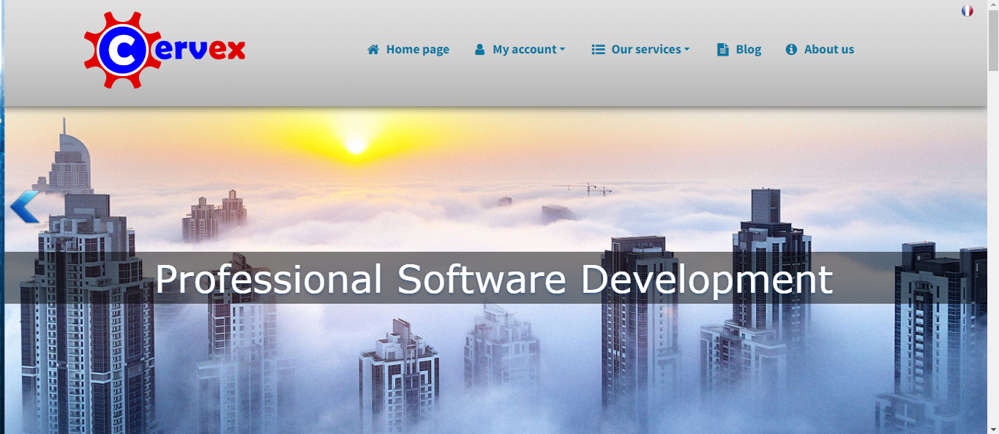
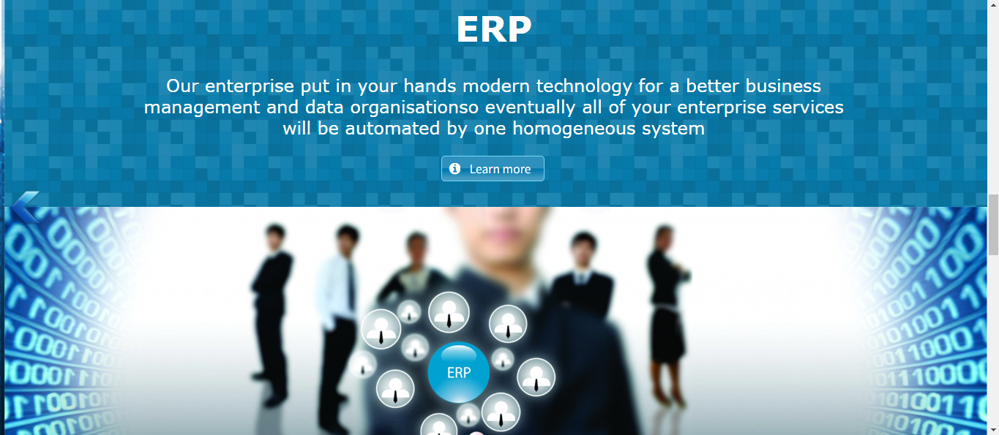
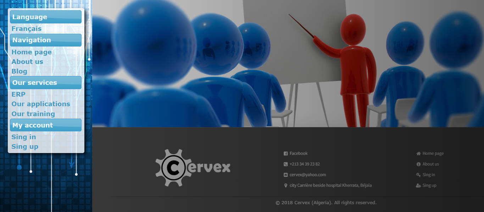
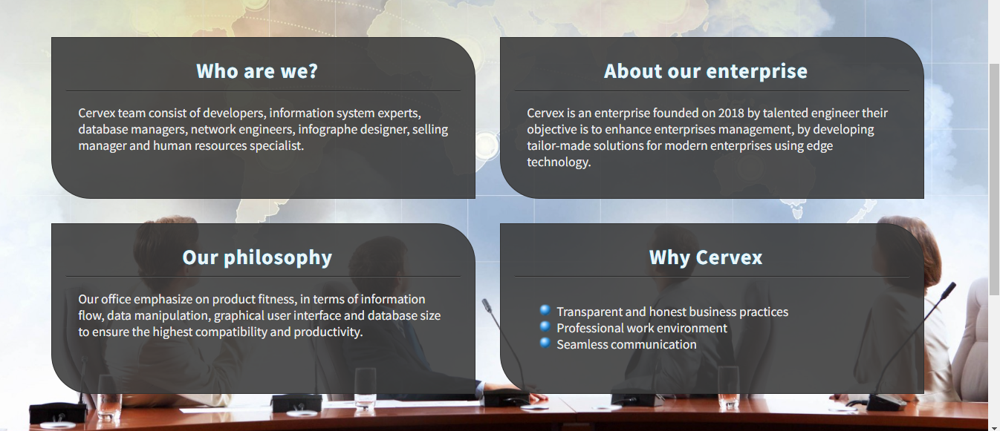
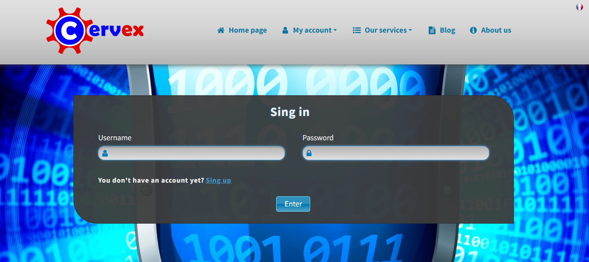
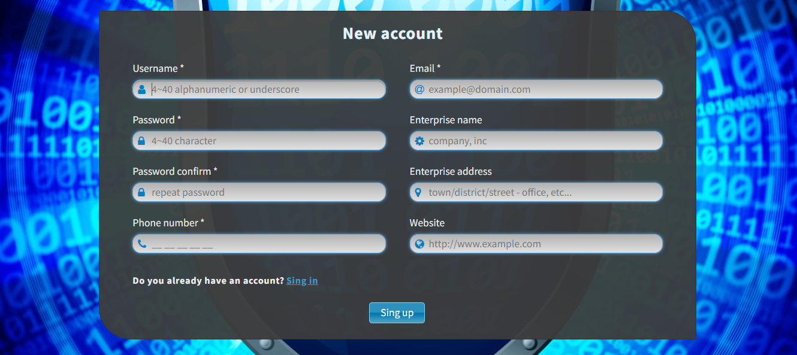
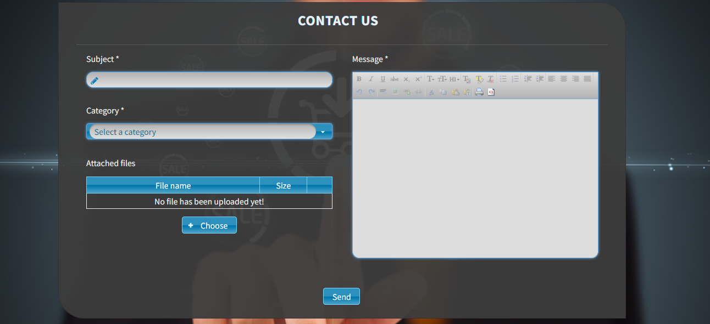

## The project context:

A newly founded software development company called Cervex wanted to create a website, mostly a simple static website, but since they had a dozen clients with relatively small projects (a few Microsoft Access apps, a simple desktop utility used by accountants, etc) they wanted a page to track the progress of each project and allowing each client to follow updates on their product without having to call the company daily.

## The technologies used:

This was my first professional project in my career, as the only developer of this project, I had the opportunity to select the technology stack, I intentionally chose Java EE 7 (with MySQL as the database) over a simpler PHP framework because I wanted to gain practical experience with a technology widely used by the top Algerian companies.
Other frameworks like Angular and React were already mainstream technologies by 2018, but they were still relatively niche frameworks within the Algerian market, that's why I dropped them.

## Screenshots:

---

---

---

---

---

---

---

## License

This project is licensed under the [GNU General Public License, Version 3](https://www.gnu.org/licenses/gpl-3.0.en.html) - see the [LICENSE](LICENSE.txt) file for details.

The GNU GPL v3 is a strong copyleft license that ensures anyone who receives a copy of your software also gets the source code and the same rights to use, modify, and distribute the software.

### Permissions

- You are free to use, modify, and distribute this software.
- You can distribute your own modified versions, but they must also be licensed under the GNU GPL v3.
- This license ensures that users have the same rights you received when using this software.

### Limitations

- You must make any modifications to the source code available under the same GNU GPL v3 license.
- If you distribute this software, you must provide the source code to recipients.
- This license is intended to protect users' freedom, so any restrictions on these freedoms are not allowed.

*For a full understanding of your rights and responsibilities, please refer to the [official license](https://www.gnu.org/licenses/gpl-3.0.en.html).*

## Contact me

If you have any questions or inquiries about this project, please don't hesitate to contact the main developer at [youcef-debbah@hotmail.com](mailto:youcef-debbah@hotmail.com).